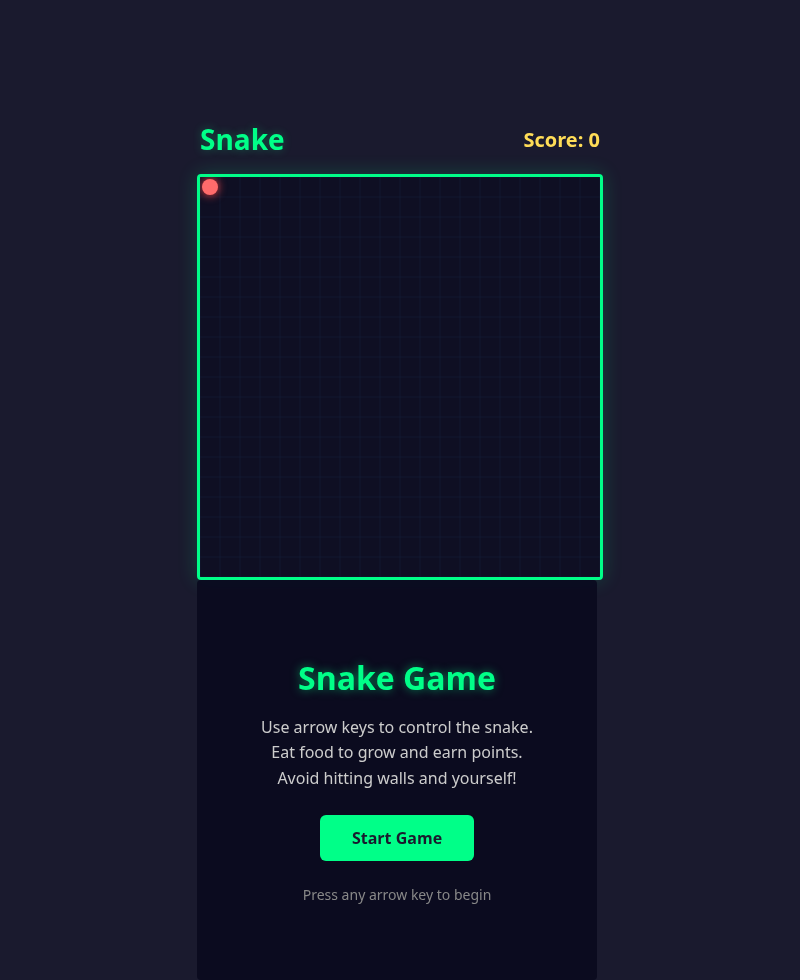
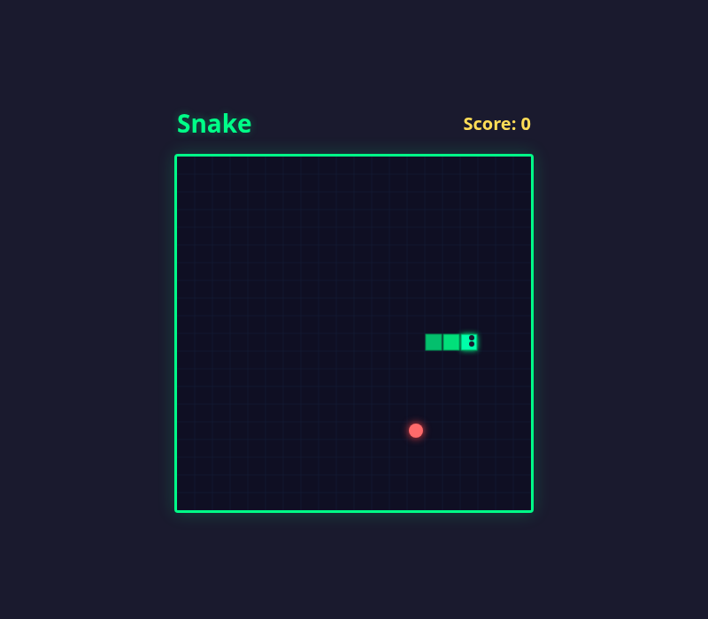
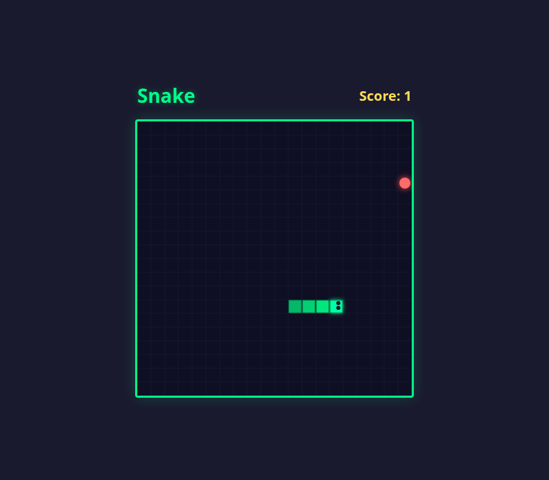
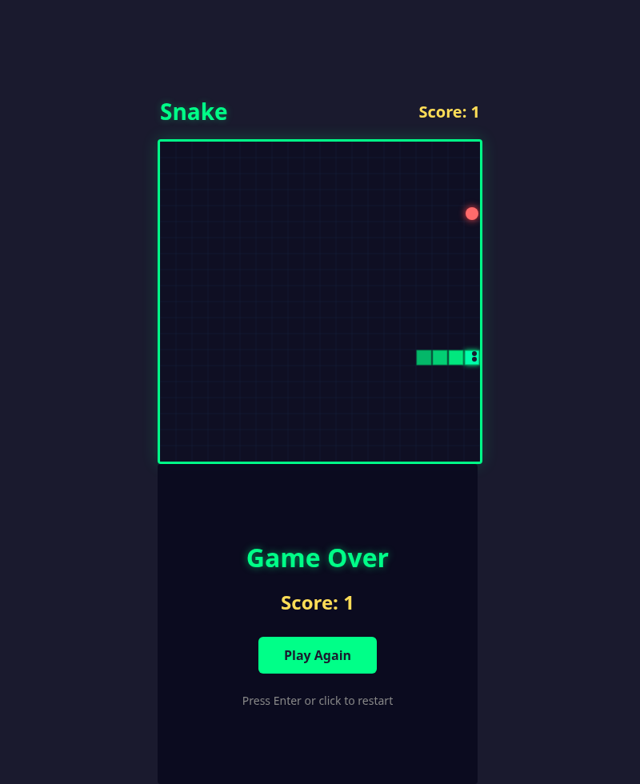

# 🐍 Snake Game

A classic Snake game built with HTML5 Canvas, CSS, and JavaScript. Fully self-contained in a single HTML file with no external dependencies. The project features multiple themed snake variants across different branches, each with unique visual identities and atmospheres.

---

## Table of Contents

- [Screenshots](#screenshots)
- [How to Play](#how-to-play)
- [Snake Types](#snake-types)
  - [Classic Snake](#classic-snake-main-branch)
  - [Abyssal Serpent - Ocean Theme](#abyssal-serpent---ocean-theme-featureocean-snake-branch)
  - [Cosmic Serpent - Space Theme](#cosmic-serpent---space-theme-featurespace-snake-branch)
  - [Comparison at a Glance](#comparison-at-a-glance)
- [Features](#features)
- [Getting Started](#getting-started)
- [Project Structure](#project-structure)
- [Browser Compatibility](#browser-compatibility)
- [Technical Details](#technical-details)
- [Contributing](#contributing)
- [License](#license)

---

## Screenshots

| Start Screen | Gameplay Start |
|:---:|:---:|
|  |  |

| Active Gameplay | Game Over |
|:---:|:---:|
|  |  |

---

## How to Play

1. Open `index.html` in any modern web browser.
2. Click **Start Game** or press any arrow key to begin.
3. Use the **arrow keys** to control the snake's direction:
   - ⬆️ Up Arrow: Move up
   - ⬇️ Down Arrow: Move down
   - ⬅️ Left Arrow: Move left
   - ➡️ Right Arrow: Move right
4. Eat the food to grow longer and increase your score.
5. Avoid hitting the walls or your own tail.
6. When the game ends, press **Enter** or click **Play Again** to restart.

---

## Snake Types

The game includes three distinct snake themes, each living on its own branch:

### Classic Snake (`main` branch)

The default neon-green snake with a clean, modern aesthetic.

| Attribute | Details |
|-----------|---------|
| **Theme** | Dark retro-modern arcade |
| **Head color** | Bright cyan-green (`#00ffaa`) with a subtle green glow |
| **Body color** | Neon green (`#00ff88`) with an alpha gradient that fades toward the tail |
| **Outline** | Dark green border (`#009955`) on every segment |
| **Eyes** | Two small dark circles (`#1a1a2e`) that reposition based on the direction of travel |
| **Shape** | Grid-aligned square segments (1 px padding between cells) |
| **Food** | Red circle (`#ff6b6b`) with a red glow (`#ff4444`, 10 px blur) |
| **Background** | Dark navy (`#0f0f23`) with faint blue-gray grid lines (`#16213e`) |
| **Movement** | Discrete grid-based movement at ~8 fps; body segments follow the head path |
| **Growth** | Each food item adds one segment to the tail; the body opacity gradient recalculates dynamically |

---

### Abyssal Serpent - Ocean Theme (`feature/ocean-snake` branch)

A bioluminescent deep-sea serpent gliding through an underwater abyss.

| Attribute | Details |
|-----------|---------|
| **Theme** | Deep-ocean bioluminescence |
| **Head color** | Radial gradient from bright mint (`#7dffd8`) at the center to teal-green (`#1fbf8f`) at the edge |
| **Head shape** | Circular (arc-rendered) instead of square, giving a smooth organic look |
| **Body color** | Linear gradient from the head color (`#7dffd8`) to deep teal (`#1fbf8f`), drawn as a single smooth path |
| **Body rendering** | Quadratic Bezier curves through segment centers create a fluid, snake-like silhouette instead of blocky squares |
| **Bioluminescent core** | A thinner, brighter stroke (`rgba(230, 255, 245, 0.5)`) runs through the center of the body for a glowing-from-within effect |
| **Glow** | Teal outer glow (`#39e6c8`, 8 px shadow blur) surrounds the entire serpent |
| **Eyes** | Dark circles (`#021019`) positioned directionally on the round head |
| **Food** | "Glowing pearl" with a radial gradient from white to pale cyan (`#eafcff`) to blue glow (`#7fdfff`); pulses rhythmically |
| **Background** | Vertical water gradient: teal surface (`#0e8a99`) through mid-depth blue (`#063a4d`) to near-black abyss (`#02121d`) |
| **Ambient effects** | Diagonal caustic light rays that drift slowly, plus 22 rising bubbles that wobble side-to-side |
| **Grid** | Nearly invisible (`rgba(127, 223, 255, 0.05)`) to preserve immersion |
| **Movement** | Same grid logic as classic, but the smooth curve rendering makes motion appear fluid |
| **Growth** | New segments extend the Bezier path; the head-to-tail gradient stretches accordingly |

**Color Palette:**
- Primary serpent: `#1fbf8f` (teal-green), `#7dffd8` (mint highlight), `#39e6c8` (glow)
- Pearl food: `#eafcff` (white-blue), `#7fdfff` (cyan glow)
- Water: `#0e8a99` / `#063a4d` / `#02121d` (light to deep)
- UI accent: `#39e6c8` (borders, buttons, title text)

---

### Cosmic Serpent - Space Theme (`feature/space-snake` branch)

A spaceship-styled snake flying through a star-filled cosmos, collecting celestial objects.

| Attribute | Details |
|-----------|---------|
| **Theme** | Outer space / sci-fi spacecraft |
| **Head shape** | Arrow/triangle spaceship that rotates to face the current direction of travel |
| **Head color** | Linear gradient from dark indigo (`#1a237e`) to bright cyan (`#00e5ff`) with a white cockpit window and orange engine glow |
| **Body color** | Radial gradient orbs that shift from cyan (near head) to purple (near tail); each segment is a glowing sphere rather than a square |
| **Body rendering** | Individual radial-gradient circles with a bright white core and fading outer edge; opacity and size decrease toward the tail |
| **Glow** | Cyan-purple aura (`#00e5ff` / `rgba(100, 50, 255)`) with per-segment shadow blur |
| **Thruster particles** | Orange-red particle trail emitted behind the ship head in the opposite direction of travel |
| **Food types** | Three randomized collectibles: (1) Orange planet with orbital ring, (2) Yellow 5-pointed star, (3) Pulsating cyan-purple energy orb |
| **Food animations** | All food types pulse rhythmically; collecting any triggers a 12-particle color burst |
| **Background** | Deep space black (`#0a0a1a`) with a purple nebula radial gradient and 120 twinkling stars that drift vertically |
| **Grid** | Extremely subtle dark blue lines (`rgba(30, 40, 80, 0.15)`) |
| **Movement** | Grid-based logic with continuous background animation (starfield scroll, particle updates) running independently via `requestAnimationFrame` |
| **Growth** | New body orbs appear with full brightness near the head and automatically inherit the head-to-tail gradient |
| **Score label** | Displayed as "Energy" instead of "Score" |

**Color Palette:**
- Ship/body: `#00e5ff` (cyan), `#7c4dff` (purple), `#1a237e` (indigo)
- Food: `#ff6e40` (planet), `#fdd835` (star), `#00e5ff` / `#7c4dff` (energy orb)
- Particles: `#00e5ff`, `#7c4dff`, `#ff4081`, `#ffab40`, `#69f0ae`
- Background: `#0a0a1a` (space black), `rgba(26, 0, 51, 0.3)` (nebula)
- UI accent: `#00e5ff` (borders, buttons, title glow)

---

### Comparison at a Glance

| Feature | Classic | Ocean (Abyssal Serpent) | Space (Cosmic Serpent) |
|---------|---------|------------------------|------------------------|
| Snake shape | Square segments | Smooth Bezier curve | Glowing orb chain |
| Head style | Square with eyes | Rounded circle with eyes | Arrow-shaped spaceship |
| Body gradient | Opacity fade (green) | Color fade with luminous core | Size + color fade (cyan to purple) |
| Food | Red glowing circle | White-cyan pulsing pearl | Rotating planets, stars, or orbs |
| Background | Static dark grid | Animated water with caustics and bubbles | Animated starfield with nebula |
| Particle effects | None | Rising bubbles | Thruster trail + collection bursts |
| Overall mood | Clean arcade | Mysterious deep-sea | High-energy sci-fi |

---

## Features

- Smooth canvas-based rendering on a 20×20 grid
- Score tracking with on-screen display
- Start screen with instructions
- Game over screen with final score and restart option
- Visual polish: gradient snake body, glowing food, subtle grid, and animated eyes
- Multiple themed variants with unique art styles and ambient effects
- No external dependencies required

---

## Getting Started

No build tools or package managers are needed — just a web browser.

```bash
# Clone the repository
git clone <repository-url>
cd SnakeGame

# Open the game in your default browser
open index.html        # macOS
xdg-open index.html    # Linux
start index.html       # Windows
```

To try a different snake theme, switch to the corresponding branch:

```bash
git checkout feature/ocean-snake   # Abyssal Serpent
git checkout feature/space-snake   # Cosmic Serpent
```

---

## Project Structure

```
SnakeGame/
├── index.html          # Complete game (HTML + CSS + JS in one file)
├── README.md           # This file
└── screenshots/
    ├── 01-start-screen.png
    ├── 02-gameplay-start.png
    ├── 03-gameplay-active.png
    └── 04-game-over.png
```

Each themed variant follows the same single-file structure on its respective branch.

---

## Browser Compatibility

The game runs in any modern browser that supports the HTML5 `<canvas>` element and ES6 JavaScript.

| Browser | Supported |
|---------|:---------:|
| Chrome 60+ | ✅ |
| Firefox 55+ | ✅ |
| Safari 11+ | ✅ |
| Edge 79+ (Chromium) | ✅ |
| Opera 47+ | ✅ |
| Internet Explorer | ❌ |

Mobile browsers are supported but the game currently requires a keyboard for input.

---

## Technical Details

- Pure HTML5, CSS, and JavaScript — no frameworks or libraries
- Canvas size: 400×400 pixels
- Grid: 20×20 cells (20 px per cell)
- Game speed: ~8 frames per second (120 ms tick interval)
- Collision detection for walls and self-intersection
- Direction buffering prevents 180-degree reversals
- Each theme is a self-contained single HTML file

---

## Contributing

Contributions are welcome! Here's how to get involved:

1. **Fork** the repository.
2. **Create a feature branch** from `main` (e.g., `feature/my-new-theme`).
3. **Make your changes** — keep the single-file architecture intact.
4. **Test** in multiple browsers to ensure compatibility.
5. **Open a pull request** with a clear description of what you changed and why.

### Ideas for Contributions

- New snake themes (e.g., desert, jungle, retro 8-bit)
- Touch/swipe controls for mobile devices
- Sound effects and background music
- High-score persistence via `localStorage`
- Difficulty settings (speed ramp-up, larger grid)

---

## License

This project is licensed under the [MIT License](LICENSE).

> If no `LICENSE` file exists yet, one should be added to formalize the terms.
